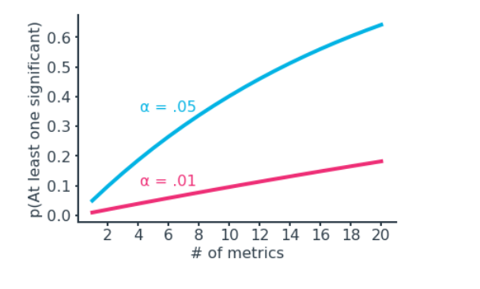

# Statistical Considerations in Testing

 You might think that the importance of statistics in experiment design lies only in analyzing the results of an experiment but in reality there's actually more importance for statistics in your experimental design rather than just coming in at the end.  

As known Factors like how much data  we will need before we can judge our experiment's success on solid grounds and the size of the effect that you want to see can have a major effect on how much data you need to collect and how long it will take before you get your results In this Repos  

* you'll learn about how statistical techniques can help you answer questions related to setting up an experiment. 

* you'll learn about some tricky pitfalls that can come as a part of enlightened outcomes of an experiment. 

## 1. [Statistical Significance](https://www.khanacademy.org/math/ap-statistics/tests-significance-ap/idea-significance-tests/v/idea-behind-hypothesis-testing)

 In most experiments, If the probability of something  that happened by chance is less than 5% or less than 1% then the probability would definitely significant. please check out [this notebook](https://github.com/A2Amir/Statistical-Considerations-in-Testing/blob/master/code/Statistical_Significance.ipynb) to get more onformation. 

## 2. Practical Significance

Even if an experiment result shows a statistically significant difference in an evaluation metric between control and experimental groups, that does not necessarily mean that the experiment was a success. If there are any costs associated with deploying a change, those costs might outweigh the benefits expected based on the experiment results. **Practical significance refers to the level of effect that you need to observe in order for the experiment to be called a true success and implemented in truth**. Not all experiments imply a practical significance boundary, but it's an important factor in the interpretation of outcomes where it is relevant.

**If you consider the confidence interval for an evaluation metric statistic against the null baseline and practical significance bound, there are a few cases that can come about:**

(Below, m0 indicates the null statistic value, dmin the practical significance bound, and the blue line the confidence interval for the observed statistic. We assume that we're looking for a positive change, ignoring the negative equivalent for dmin.)

* **Confidence interval is fully in practical significance region:**
 
  If the confidence interval for the statistic does not include the null or the practical significance level, then the experimental manipulation can be concluded to have a statistically and practically significant effect. It is clearest in this case that the manipulation should be implemented as a success.
 
    

   
   

    
    
* **Confidence interval completely excludes any part of practical significance region:**
 
  If the confidence interval does not include any values that would be considered practically significant, this is a clear case for us to not implement the experimental change. This includes the case where the metric is statistically significant, but whose interval does not extend past the practical significance bounds. With such a low chance of practical significance being achieved on the metric, we should be wary of implementing the change.
 
    

   
   

    
* **Confidence interval includes points both inside and outside practical significance bounds:**
 
  This leaves the trickiest cases to consider, where the confidence interval straddles the practical significance bound. In each of these cases, there is an uncertain possibility of practical significance being achieved. In an ideal world, you would be able to collect more data to reduce our uncertainty, reducing the scenario to one of the previous cases. Outside of this, you'll need to consider the risks carefully in order to make a recommendation on whether or not to follow through with a tested change. Your analysis might also reveal subsets of the population or aspects of the manipulation that do work, in order to refine further studies or experiments.
 
    

   
   

## 3. [Experiment Size](https://www.youtube.com/watch?v=QBONLUp7i28)

We can use the knowledge of our desired practical significance boundary to plan out our experiment by knowing how many observations we need in order to detect our desired effect to our desired level of reliability, we can see how long we would need to run our experiment and whether or not it is feasible. please check out [this notebook](https://github.com/A2Amir/Statistical-Considerations-in-Testing/blob/master/code/Experiment_Size.ipynb) to get more onformation. 

## 3. Using Dummy Tests

When it comes to designing an experiment, it might be useful to run a **dummy test** as a predecessor to or as part of that process. **In a dummy test, you will implement the same steps that you would in an actual experiment to assign the experimental units into groups. However, the experimental manipulation won't actually be implemented, and the groups will be treated equivalently**.

There are multiple reasons to run a dummy test:
* First, a dummy test can expose if there are any errors in the randomization or assignment procedures. A short dummy test can be worth the investment if an invariant metric is found to have a statistically significant difference, or if some other systematic bias is identified, because it can help avoid larger problems down the line. 
    

   
   

* A second reason to run a dummy test is to collect data on metrics' behaviors. If historic data is not enough to predict the outcome of recorded metrics or allow for experiment duration to be computed, then a dummy test can be useful for getting baselines.

Of course, performing a dummy test requires an investment of resources, the most important of which is time. If time is of the essence, then you may need to just go ahead with the experiment, keeping an eye on invariant metrics for any trouble. An alternative approach is to perform a hybrid test. In the A/B testing paradigm, this can take the form of an A/A/B test. That is, we split the data into three groups: two control and one experimental. A comparison between control groups can be used to learn about null-environment properties before making inferences on the effect of the experimental manipulation.

## 4. Non-Parametric Tests

Up until now, you've been using **standard hypothesis tests on means of normal distributions** to design and analyze experiments. However, it's possible that you will encounter scenarios where you can't rely on only standard tests. This might be due to uncertainty about the true variability of a metric's distribution, a lack of data to assume normality, or wanting to do inference on a statistic that lacks a standard test. It's useful to know about some **non-parametric tests**. The main benefit of non-parametric tests is that they don't rely on many assumptions of the underlying population, and so can be used in a wider range of circumstances compared to standard tests. 

* In this [notebook](https://github.com/A2Amir/Statistical-Considerations-in-Testing/blob/master/code/Non-Parametric_Tests_Part_1.ipynb), you'll cover **two non-parametric approaches (Bootstrapping, Permutation Tests)** that use resampling of the data to make inferences about distributions and differences.

* In this [notebook](https://github.com/A2Amir/Statistical-Considerations-in-Testing/blob/master/code/Non-Parametric_Tests_Part_2.ipynb), I'll cover you **two onther non-parametric approaches (Rank-Sum Test (Mann-Whitney), Sign  Tests)** that are fairly different from the two previous approaches and dont use resamplng to make inferences about distributions and differences.They use the collected data to compute a test result.

## 5. Analyzing Multiple Metrics

If you're tracking multiple evaluation metrics, make sure that you're aware of how the Type I error rates on individual metrics can affect the overall chance of making some kind of Type I error. The simplest case we can consider is if we have _n_ independent evaluation metrics, and that seeing one with a statistically significant result would be enough to call the manipulation a success. In this case, the probability of making at least one Type I error is given by α_over = 1 - (1-α_ind)^n illustrated in the below image for individual α_ind=.05  and α_ind = .01.

   

   
   

    
To protect against this, we need to introduce a correction factor on the individual test error rate so that the overall error rate is at most the desired level. A conservative approach is to divide the overall error rate by the number of metrics tested:

          α_ind=α_over/n

This is known as **the Bonferroni correction**. If we assume independence between metrics, we can do a little bit better with the **Šidák correction**:

          α_ind = 1−(1−α_over)^1/n
          
          
  

  
  

   
   
   In real life, evaluation scenarios are rarely so straightforward. Metrics will likely be correlated in some way, rather than being independent. If a positive correlation exists, then knowing the outcome of one metric will make it more likely for a correlated metric to also point in the same way. In this case, the corrections above will be more conservative than necessary, resulting in an overall error rate smaller than the desired level. (In cases of negative correlation, the true error rate could go either way, depending on the types of tests performed.)

In addition, we might need multiple metrics to show statistical significance to call an experiment a success, or there may be different degrees of success depending on which metrics appear to be moved by the manipulation. One metric may not be enough to make it worth deploying a change tested in an experiment. Reducing the individual error rate will make it harder for a truly significant effect to show up as statistically significant. That is, reducing the Type I error rate will also increase the Type II error rate – another conservative shift.

Ultimately, there is a small balancing act when it comes to selecting an error-controlling scheme. Being fully conservative with one of the simple corrections above means that you increase the risk of failing to roll out changes that actually have an impact on metrics. Consider the level of dependence between metrics and what results are needed to declare a success to calibrate the right balance in error rates. If you need to see a significant change in all of your metrics to proceed with it, you might not need a correction factor at all. You can also use dummy test results, bootstrapping, and permutation approaches to plan significance thresholds. Finally, don't forget that practical significance can be an all-important quality that overrides other statistical significance findings.

 it's worth noting that these cautions also apply to invariant metrics. The more invariant metrics you test, the more likely it will be that some test will show a statistically significant difference even if the groups tested are drawn from equivalent populations. However, it might not be a good idea to apply a correction factor to individual tests since we want to avoid larger issues with interpretation later on.
